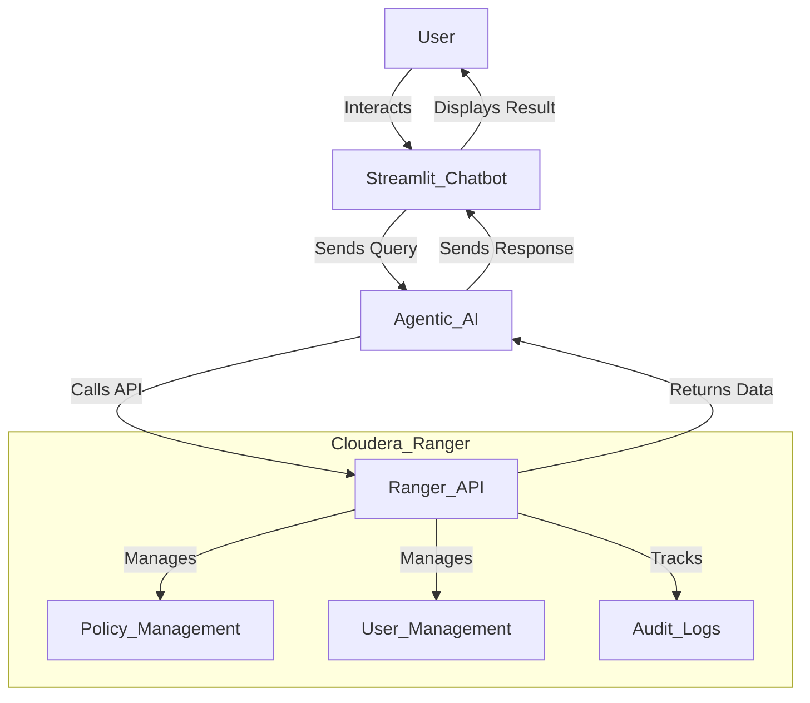

# Ranger API Project

## 📌 Overview
The **Ranger API Project** is an AI-powered agentic system that interacts with **Cloudera Ranger** using various API functions. The project utilizes **Agentic AI (OpenAI)** to automate and manage Ranger policies, users, and permissions efficiently. It also features a **Streamlit-based chatbot** to provide an interactive UI for querying and managing Ranger resources.

## 🚀 Features
- **Agentic AI Integration** – Uses OpenAI to enhance API interactions.
- **Streamlit Chatbot** – Provides an intuitive UI for querying and managing policies.
- **Policy Management** – Create, retrieve, update, and delete policies.
- **User Management** – Add, remove, and manage user access.
- **Automated Security Controls** – AI-powered policy recommendations.
- **Seamless API Communication** – Works with Cloudera Ranger REST APIs.

## 🔧 Tools & API Functions
The project integrates with Cloudera Ranger using the following API functions:

| Functionality          | API Endpoint Example |
|-----------------------|--------------------|
| **Get Policy**       | `GET /service/public/v2/api/policy/{policyId}` |
| **Create Policy**    | `POST /service/public/v2/api/policy` |
| **Update Policy**    | `PUT /service/public/v2/api/policy/{policyId}` |
| **Delete Policy**    | `DELETE /service/public/v2/api/policy/{policyId}` |
| **Get User**         | `GET /service/public/v2/api/user/{userId}` |
| **Delete User**      | `DELETE /service/public/v2/api/user/{userId}` |

## 📜 Prerequisites
- **Python 3.8+**
- **Cloudera Ranger Installed & Configured**
- **API Credentials with Admin Access**
- **OpenAI API Key**
- **Streamlit Installed** (`pip install streamlit`)

## 🏗️ Architecture Diagram
Below is the **architecture diagram** of the Ranger API project:



## ⚡ Installation
1. **Clone the Repository**
   ```bash
   git clone https://github.com/your-repo/ranger-api-project.git
   cd ranger-api-project
   ```

2. **Install Dependencies**
   ```bash
   pip install -r requirements.txt
   ```

3. **Set Up Input Variables**


4. **Run the Streamlit Chatbot**
   ```bash
   streamlit run app.py
   ```

## 📖 Usage
- **Use the chatbot UI** to interact with Ranger APIs.
- Run **GET requests** to fetch users or policies.
- Use **POST requests** to create new policies.
- AI-powered automation for **policy recommendations**.

## 🤝 Contributions
Feel free to **open an issue or pull request** to contribute! 🚀

## 📜 License
This project is licensed under the **MIT License**.

---
💡 *Powered by AI and Secure Data Governance!* 🔐
